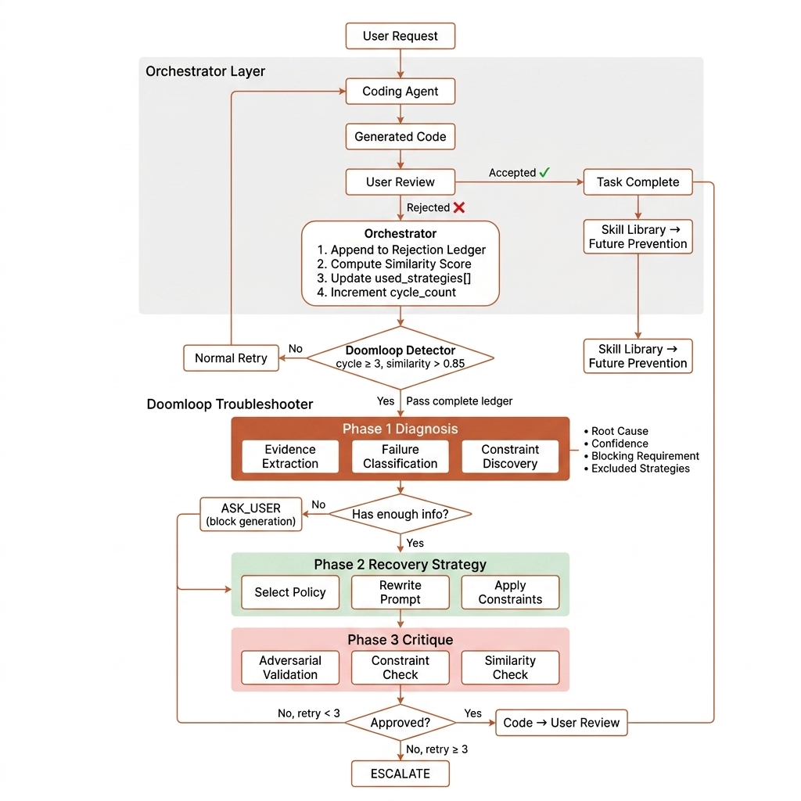
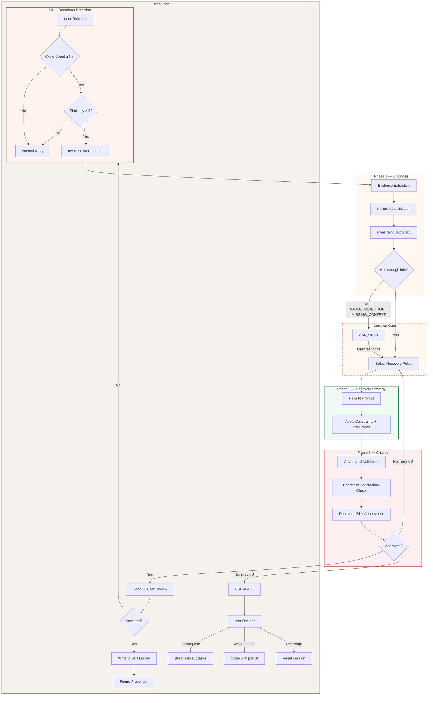
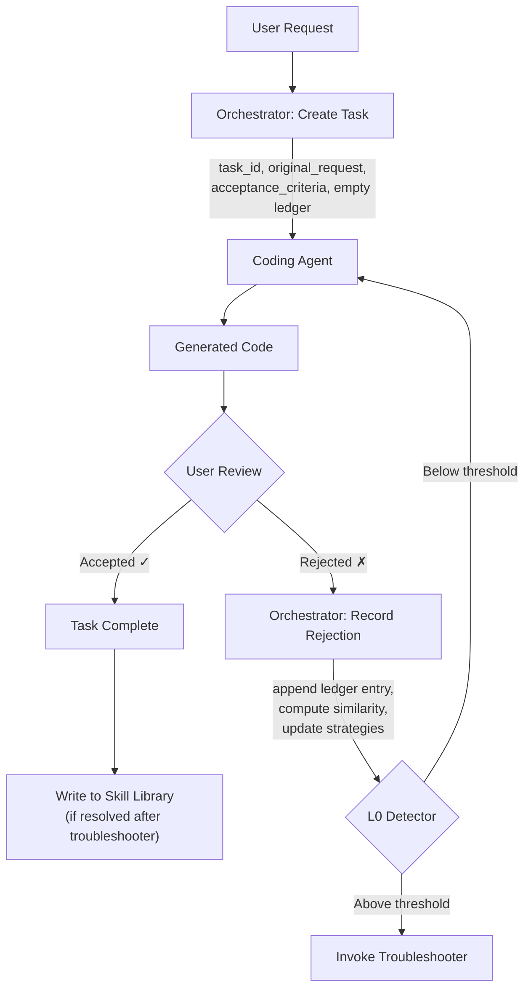
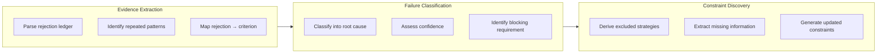
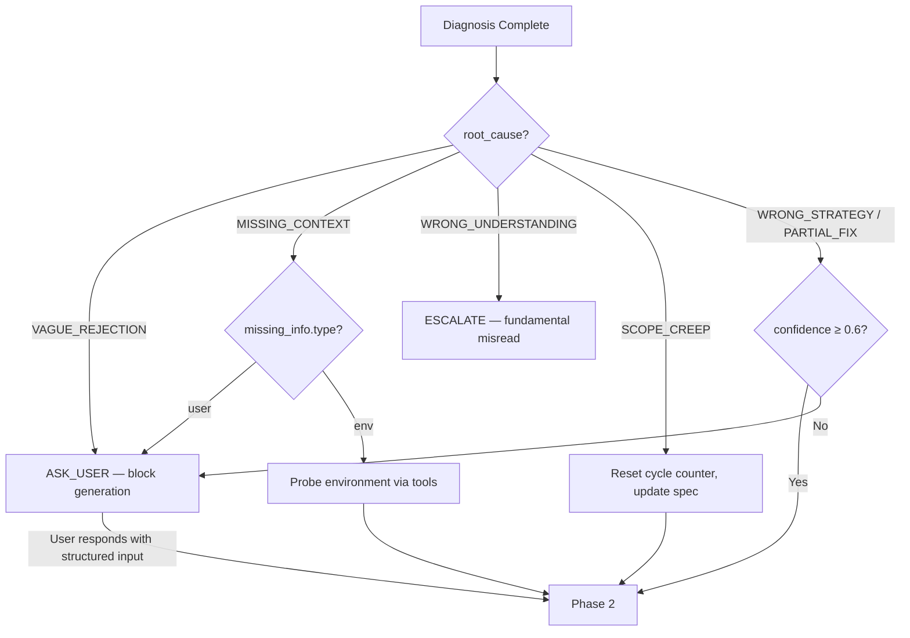
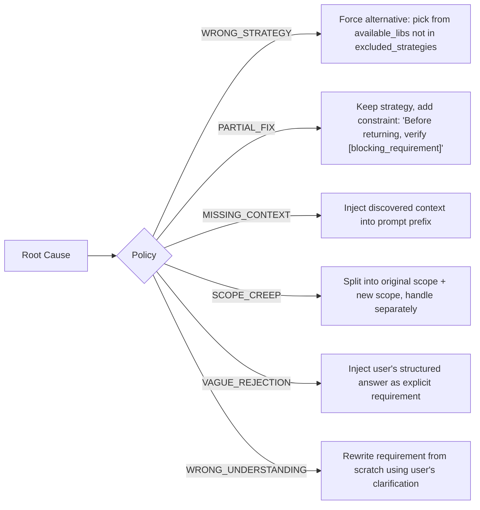
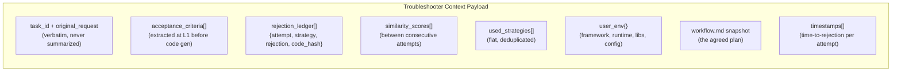
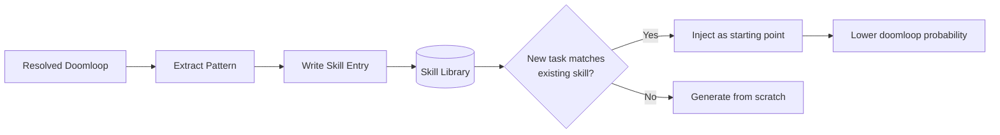

# Doomloop Troubleshooter — Architecture Spec

> A diagnostic agent that detects, classifies, and breaks cyclic failure patterns in coding agents.



---

## The Problem

Coding agents fail in cycles. A user asks the agent to implement a feature, the agent generates code, the user rejects it, and the agent regenerates — often repeating the same failing strategy with cosmetic variations. Each cycle burns compute credits, erodes user trust, and extends session time without progress.

The root issue: **the agent treats every retry as a fresh problem** instead of a constrained search. It doesn't remember what failed, doesn't know *why* it failed, and doesn't enforce that the next attempt be meaningfully different.

---

## Architecture Overview



---

## Orchestrator Layer — Building the Rejection Ledger

The orchestrator is the **always-running system layer** that sits between the user, the coding agent, and every downstream component. It is not an LLM — it is deterministic infrastructure code that records, measures, and routes. Every field the troubleshooter consumes is written by the orchestrator, never by the coding agent.

### Why the Orchestrator Exists

The rejection ledger — the "patient chart" that powers the entire troubleshooter pipeline — is **not generated when a doomloop is detected**. It is **accumulated incrementally on every rejection event**, starting from the very first rejection. By the time the L0 detector fires, the ledger is already complete. No LLM call is needed to construct it.

This is a critical architectural constraint: the coding agent is the entity that failed. Asked to summarize its own failures, it will rationalize — selecting evidence that justifies its approach rather than evidence that exposes its flaws. The orchestrator has no incentive to rationalize. It records what happened, mechanically and without interpretation.

### The Rejection Loop

Every user interaction passes through the orchestrator. The loop runs identically whether the task will eventually trigger the troubleshooter or resolve normally on the second try:



### What the Orchestrator Does at Each Stage

#### On Task Creation (before any code generation)

The orchestrator initializes the task state. This happens once, before the coding agent receives its first prompt:

| Action | Detail |
|---|---|
| Generate `task_id` | Unique identifier for this task session (e.g., `feat_oauth_google`) |
| Store `original_request` | The user's raw message, verbatim. Never summarized, never paraphrased. Summaries introduce distortion that compounds across the troubleshooter pipeline. |
| Extract `acceptance_criteria` | Uses a lightweight LLM call (or structured extraction) to decompose the request into testable criteria. This is L1 — intent validation. |
| Snapshot `user_env` | Reads the workspace: framework version, runtime version, installed packages, config files. This is what enables `MISSING_CONTEXT` classification later. |
| Initialize empty state | `rejection_ledger: []`, `similarity_scores: []`, `used_strategies: []`, `cycle_count: 0` |

#### On Every Rejection Event

This is the core of the orchestrator's value. Every time the user rejects generated code, the orchestrator performs five operations — all deterministic, no LLM call required:

| # | Operation | What it produces | Cost |
|---|---|---|---|
| 1 | **Append to rejection ledger** | `{ attempt, strategy, rejection, code_hash, timestamp }` | Storage write |
| 2 | **Compute similarity score** | Semantic similarity between this attempt and the previous one (via code embeddings) | Embedding inference (~5ms) |
| 3 | **Update `used_strategies[]`** | Flat deduplicated list of all strategies tried so far | Array operation |
| 4 | **Increment `cycle_count`** | Counter for how many rejections this task has received | Counter increment |
| 5 | **Classify rejection type** (optional) | NLP classification of the rejection text: `wrong_output` / `wrong_approach` / `new_requirement` / `vague` | Small model or rule-based (~10ms) |

The total cost of all five operations is under 20ms. This is why the orchestrator can run on every rejection without performance impact — it is not an LLM call, it is bookkeeping.

#### On Doomloop Detection (handoff to troubleshooter)

When the L0 detector fires, the orchestrator assembles the **context payload** from the state it has already accumulated. No new computation is needed — the payload is a direct serialization of the task state:

```json
{
  "task_id": "feat_oauth_google",
  "original_request": "Add Google OAuth login. After sign in, store token in httpOnly cookie and redirect to /dashboard.",
  "acceptance_criteria": ["user can sign in with Google", "token stored in httpOnly cookie", "redirect to /dashboard after login"],
  "cycle_count": 4,
  "rejection_ledger": [
    { "attempt": 1, "strategy": "passport.js", "rejection": "token not persisting after page reload", "code_hash": "a3f8e2...", "timestamp": "2024-01-15T10:03:22Z" },
    { "attempt": 2, "strategy": "passport.js", "rejection": "still not persisting, same issue", "code_hash": "b1c9d4...", "timestamp": "2024-01-15T10:04:58Z" },
    { "attempt": 3, "strategy": "manual JWT", "rejection": "redirect goes to /home not /dashboard", "code_hash": "c7e2f1...", "timestamp": "2024-01-15T10:08:14Z" },
    { "attempt": 4, "strategy": "manual JWT", "rejection": "redirect still wrong", "code_hash": "d5a3b8...", "timestamp": "2024-01-15T10:09:47Z" }
  ],
  "similarity_scores": [0.93, 0.71, 0.89],
  "used_strategies": ["passport.js", "manual JWT"],
  "user_env": { "framework": "Next.js 14", "runtime": "Node 20", "available_libs": ["next-auth"] }
}
```

### How Strategy Detection Works

The `strategy` field in each ledger entry is not self-reported by the coding agent — the orchestrator determines it through one of three methods, ordered by reliability:

| Method | How it works | Reliability | Cost |
|---|---|---|---|
| **Declared intent** (recommended) | The coding agent's prompt requires it to state its intended approach before generating code. The orchestrator captures this declaration. | High — agent states its plan explicitly | Zero (part of the existing prompt) |
| **Import analysis** | The orchestrator parses the generated code for import statements and maps them to known strategy categories (e.g., `import passport` → "passport.js") | Medium — catches library-level strategies | Deterministic parsing (~1ms) |
| **Lightweight classifier** | A small model or embedding-based classifier labels the code's approach against a taxonomy of known strategies | Medium — handles novel approaches | Small model inference (~20ms) |

The declared intent method is preferred because it catches strategy decisions before code is generated — import analysis can only detect them after. For the first version, declared intent + import fallback covers >95% of cases.

### State Lifecycle

```
Task Created                    Task Resolved or Escalated
    │                                      │
    ▼                                      ▼
┌──────────────────────────────────────────────┐
│              Orchestrator Task State          │
│                                              │
│  task_id ─────────── set once at creation    │
│  original_request ── set once, never mutated │
│  acceptance_criteria ── set at L1 extraction │
│  cycle_count ──────── incremented per reject │
│  rejection_ledger[] ─ appended per reject    │
│  similarity_scores[] ─ appended per reject   │
│  used_strategies[] ── updated per reject     │
│  user_env ─────────── snapshot at creation   │
│                                              │
│  State is APPEND-ONLY. No field is ever      │
│  overwritten or deleted. The full history    │
│  is always available for diagnosis.          │
└──────────────────────────────────────────────┘
```

> **Key design principle**: The task state is **append-only**. No field is ever overwritten, mutated, or deleted during the session. This guarantees that by the time the troubleshooter is invoked, it has complete, unedited history — not a summary, not a selection, but every rejection event exactly as it occurred.

### What the Orchestrator Does NOT Do

The boundary between the orchestrator and the troubleshooter is deliberate:

| Orchestrator (deterministic) | Troubleshooter (LLM-powered) |
|---|---|
| Records rejection text | Interprets rejection meaning |
| Computes code similarity | Diagnoses root cause from similarity patterns |
| Tracks which strategies were used | Decides which strategy to try next |
| Counts cycles | Decides whether to continue, ask, or escalate |
| Assembles the payload | Consumes the payload and produces structured output |

The orchestrator never makes diagnostic decisions. It provides evidence. The troubleshooter makes judgments. This separation ensures the evidence is unbiased — it was recorded before any diagnostic model saw it.

---

## L0 — Doomloop Detection

Detection is **cheap and deterministic** — no LLM call. It runs on every user rejection and decides whether to invoke the (expensive) troubleshooter.

### Trigger Conditions

| Signal | Threshold | Rationale |
|---|---|---|
| Cycle count | ≥ 3 rejections on same `task_id` | Two retries is normal; three is a pattern |
| Semantic similarity | > 0.85 between consecutive attempts | Agent is producing near-identical code with cosmetic changes |
| Strategy repetition | Same strategy used ≥ 2 times | Agent isn't exploring the solution space |

All three are computed **by the orchestration layer**, not the coding agent — the agent that looped should not summarize its own failures.

### What "similarity" means

Not string diff. Semantic similarity via code embeddings (e.g., CodeBERT, StarCoder embeddings). The agent may rename variables, reorder functions, or restructure slightly while doing the exact same thing. Hash comparison misses this; embedding similarity catches it.

---

## Phase 1 — Diagnosis

**Role**: Analytical. Output-constrained. JSON only.
**Prompt strategy**: The diagnosis prompt must NOT generate code or suggest solutions — that's Phase 2's job. Mixing roles causes the model to bias its diagnosis toward whatever solution it's already started writing in its head.

### Sub-steps



### Root Cause Taxonomy

| Category | Signal | Example |
|---|---|---|
| `WRONG_STRATEGY` | Approach fundamentally unsuited | Using passport.js for Next.js 14 app router |
| `PARTIAL_FIX` | Part works, one sub-requirement keeps failing | Sign-in works, token persistence doesn't |
| `MISSING_CONTEXT` | Agent lacks env/config information | Doesn't know SSL mode, DB host, or framework version |
| `VAGUE_REJECTION` | User feedback too ambiguous to act on | "it's wrong", "still broken", "nope" |
| `WRONG_UNDERSTANDING` | Agent misread the original requirement | Built a validator when user wanted a formatter |
| `SCOPE_CREEP` | User added requirements mid-session | "Also add edit mode" on attempt 3 of a display component |

### Diagnosis System Prompt

```
You are a doomloop diagnosis agent for a coding assistant.
A coding agent has failed to resolve a task after multiple attempts.
Diagnose WHY the loop is happening.

You will receive a JSON payload containing:
- The original user request (verbatim)
- Acceptance criteria extracted before code generation
- Every rejected attempt: strategy used + rejection reason
- Semantic similarity scores between consecutive attempts
- User environment (framework, runtime, available libraries)

Classify root cause into exactly ONE of:
  WRONG_STRATEGY | PARTIAL_FIX | MISSING_CONTEXT
  VAGUE_REJECTION | WRONG_UNDERSTANDING | SCOPE_CREEP

Return ONLY valid JSON. No markdown. No explanation. No code.
```

### Diagnosis Output Schema

```json
{
  "root_cause": "WRONG_STRATEGY",
  "failure_category": "repeated_approach — same library tried twice despite incompatibility",
  "confidence": 0.91,
  "recommended_strategy": "next-auth",
  "excluded_strategies": ["passport.js", "manual JWT"],
  "blocking_requirement": "token stored in httpOnly cookie",
  "missing_information": {
    "type": "env",
    "question": "Is the app using Next.js app router or pages router?"
  },
  "continue_execution": true,
  "updated_constraints": [
    "MUST use next-auth v4 — passport.js and manual JWT are excluded",
    "MUST verify httpOnly cookie is set before returning success",
    "MUST redirect to /dashboard, not /home"
  ],
  "diagnosis_summary": "Attempts 1–2 used passport.js which lacks native Next.js 14 app router support. Attempts 3–4 switched to manual JWT but addressed redirect instead of the original token persistence issue — the blocking requirement was never directly targeted."
}
```

### Decision Gate (post-diagnosis)



> **Key design decision**: `VAGUE_REJECTION` and `MISSING_CONTEXT` (type: user) **block code generation**. There is no point rewriting a prompt when you don't have the information to rewrite it with. The user must provide structured input — not free-text "just fix it" — before the pipeline proceeds.

---

## Phase 2 — Recovery Strategy

**Role**: Directive. Prescriptive. Writes the next prompt.
**Prompt strategy**: This prompt must be opinionated — it forces a specific strategy, excludes failed ones, and embeds hard constraints that the coding agent cannot ignore.

### Recovery Policy Selection



### Rewritten Prompt Structure

The output of Phase 2 is a **directive prompt** that goes to the coding agent:

```
## Task
[original_request — verbatim]

## Mandatory Strategy
Use [recommended_strategy]. Do NOT use [excluded_strategies].

## Hard Constraints
[updated_constraints — injected as numbered requirements]

## Blocking Requirement
The single requirement that has never been satisfied:
→ [blocking_requirement]
Before submitting your solution, verify this requirement is met
and cite the specific line of code that satisfies it.

## Context
[user_env — framework, runtime, available libraries]
```

---

## Phase 3 — Critique

**Role**: Adversarial. The critique agent's job is to find reasons to reject — not to help.
**Prompt strategy**: Separate LLM call. The critique agent has never seen the coding agent's reasoning and judges purely on output vs. spec.

### Three Checks

| Check | What it validates | Failure action |
|---|---|---|
| **Constraint Satisfaction** | Does the code honor every item in `updated_constraints`? | → Rewrite (Phase 2) |
| **Adversarial Validation** | Does the code actually solve `blocking_requirement`? Not just claim to. | → Rewrite (Phase 2) |
| **Doomloop Risk Assessment** | Is the new code semantically similar (> 0.85) to any previously rejected attempt? | → Rewrite (Phase 2) with explicit diff requirement |

### Critique System Prompt

```
You are a code critique agent. You are adversarial — your job is
to find reasons this code should NOT be shown to the user.

You will receive:
1. The original requirement
2. Acceptance criteria
3. Hard constraints the code must satisfy
4. The blocking requirement
5. The generated code

For each criterion and constraint, state PASS or FAIL with evidence
(cite the specific line). If ANY item is FAIL, return overall: FAIL.

Do not help fix the code. Do not suggest improvements.
Only judge pass/fail with evidence.
```

### Critique Loop Limit

The critique → rewrite loop runs **at most 3 times**. If the coding agent cannot pass the critique after 3 rewrites, the troubleshooter escalates to the user. This prevents a secondary doomloop inside the troubleshooter itself.

---

## Context Payload — The "Patient Chart"

Assembled by the **orchestration layer**, never by the coding agent that looped.



| Field | Why it earns its place |
|---|---|
| `task_id` + `original_request` | Anchors the session. Always the raw user message, never a summary. |
| `acceptance_criteria` | Ground truth for the critique agent. Without this, "wrong" is undefined. |
| `rejection_ledger` | Heart of the payload. Each entry: attempt #, strategy, rejection text, code hash. |
| `similarity_scores` | Distinguishes "genuinely trying different things" from "shuffling variable names." |
| `used_strategies` | Strategy selector in Phase 2 reads this directly to enforce exclusion. |
| `user_env` | Enables `MISSING_CONTEXT` classification. Many loops happen because the agent targets the wrong library version. |
| `workflow.md` | Checks whether the agent drifted from spec or the spec was the problem. |
| `timestamps` | Fast rejection (< 30s) = obviously wrong output. Slow rejection (> 5min) = failed on testing. Different diagnoses. |

---

## Tool List

### Phase 1 Tools (Diagnosis)

| Tool | Purpose |
|---|---|
| `get_rejection_ledger` | Retrieve full history of rejected attempts for a task |
| `compute_similarity` | Semantic similarity between two code snapshots |
| `get_user_environment` | Pull framework, runtime, installed packages from workspace |
| `classify_rejection` | NLP classification of rejection text into categories |

### Phase 2 Tools (Recovery)

| Tool | Purpose |
|---|---|
| `rewrite_prompt` | Generate a new coding agent prompt with constraints injected |
| `select_strategy` | Pick from available strategies excluding failed ones |
| `ask_user_clarification` | Structured UI dialog — forces dropdown/checkbox, blocks free-text "fix it" |
| `probe_environment` | Auto-detect missing config (DB host, SSL mode, env vars) |

### Phase 3 Tools (Critique)

| Tool | Purpose |
|---|---|
| `run_acceptance_tests` | Execute test stubs generated from acceptance criteria |
| `check_constraint_satisfaction` | Verify each constraint in `updated_constraints` against the code |
| `compute_diff_delta` | Measure how different the new code is from rejected versions |

---

## Output Shapes

The troubleshooter produces **three possible outputs**, each routed differently:

### Output 1 — REIMPLEMENT (most common)

```json
{
  "action": "REIMPLEMENT",
  "root_cause": "WRONG_STRATEGY",
  "directive": {
    "prompt": "Implement Google OAuth using next-auth v4...",
    "forced_strategy": "next-auth",
    "excluded_strategies": ["passport.js", "manual JWT"],
    "priority_criterion": "token stored in httpOnly cookie"
  },
  "critique_result": { "overall": "PASS", "blocking_req_handled": true }
}
```
**Route**: → Coding agent receives directive → generates code → user sees it.

### Output 2 — ASK_USER

```json
{
  "action": "ASK_USER",
  "root_cause": "VAGUE_REJECTION",
  "block_generation": true,
  "dialog": {
    "message": "I've attempted this 4 times. To break the loop, I need one specific answer:",
    "question": "Which of these is still broken?",
    "options": [
      "The token is not being stored at all",
      "The token expires too quickly",
      "The redirect goes to the wrong path",
      "Something else entirely"
    ],
    "require_selection": true
  }
}
```
**Route**: → UI renders structured dialog → user must pick an option → troubleshooter resumes at Phase 2.

### Output 3 — ESCALATE

```json
{
  "action": "ESCALATE",
  "root_cause": "WRONG_UNDERSTANDING",
  "summary": {
    "attempts": 4,
    "what_was_tried": ["passport.js (1–2)", "manual JWT (3–4)"],
    "what_never_worked": "token persistence",
    "closest_attempt": 3,
    "partial_progress": "Sign-in and redirect work. Only persistence is broken."
  },
  "options_for_user": [
    { "id": "decompose", "label": "Break into smaller tasks" },
    { "id": "accept_partial", "label": "Accept what works, handle the rest manually" },
    { "id": "reprompt", "label": "Rewrite the requirement from scratch" }
  ]
}
```
**Route**: → UI shows full history + options → no more automatic attempts.

---

## Metrics & Thresholds

| Metric | Definition | Target | Why it matters |
|---|---|---|---|
| **DLR** (Doomloop Rate) | % of tasks that trigger the troubleshooter | < 5% | North-star metric — measures overall system health |
| **FTR** (First-Try Resolution) | % of tasks resolved without any rejection | > 60% | Higher is better; indicates L1 (intent) is working |
| **ACE** (Avg Cycles to Resolution) | Mean rejection count before task closes | < 2.0 | If > 3, Phase 2 strategy selection needs tuning |
| **TTR** (Troubleshooter Resolution Rate) | % of doomloops resolved by troubleshooter without escalation | > 70% | Measures troubleshooter effectiveness |
| **Inter-Rejection Interval** | Time between receiving code and sending rejection | Track distribution | < 30s = obviously wrong; > 5min = failed on testing |
| **Skill Library Hit Rate** | % of new tasks that match an existing skill | Track growth | Compounding prevention metric |

---

## Design Decisions & Rationale

### Why three separate prompts, not one?

Each phase has a different failure mode. Diagnosis needs to be analytical (JSON only, no code temptation). Strategy rewrite needs to be directive. Critique needs to be adversarial. Mixing them into one prompt causes the model to conflate roles — the diagnosis becomes biased toward a solution it's already started writing.

### Why `ask_user_clarification` is a tool, not a raw message?

Raw messages let the user reply with "just fix it" again, re-entering the loop. A tool forces a structured UI — dropdown, required selection — so the response has signal the troubleshooter can use.

### Why critique routes back to Phase 2, not to the user?

The user should only ever see attempts that have passed the gate. Showing partial progress that the critique agent already knows is broken burns trust and turns one rejection into two.

### Why the payload is assembled by the orchestrator, not the coding agent?

The coding agent is the one that looped. It will rationalize its failures. The ledger is written by the system on every rejection event — by the time the troubleshooter is invoked, the payload is complete without an LLM call.

### Why detection is separated from diagnosis?

Detection is cheap (counter + similarity check, no LLM call). Diagnosis is expensive (full LLM call with context payload). Running the troubleshooter on every rejection wastes credits on healthy retry patterns. The detector gates the expense.

---

## Metrics & Thresholds

| Metric | Definition | Target | Why it matters |
|---|---|---|---|
| **DLR** (Doomloop Rate) | % of tasks that trigger the troubleshooter | < 5% | North-star metric — measures overall system health |
| **FTR** (First-Try Resolution) | % of tasks resolved without any rejection | > 60% | Higher is better; indicates L1 (intent) is working |
| **ACE** (Avg Cycles to Resolution) | Mean rejection count before task closes | < 2.0 | If > 3, Phase 2 strategy selection needs tuning |
| **TTR** (Troubleshooter Resolution Rate) | % of doomloops resolved by troubleshooter without escalation | > 70% | Measures troubleshooter effectiveness |
| **Inter-Rejection Interval** | Time between receiving code and sending rejection | Track distribution | < 30s = obviously wrong; > 5min = failed on testing |
| **Skill Library Hit Rate** | % of new tasks that match an existing skill | Track growth | Compounding prevention metric |
| **VRR** (Vague Rejection Rate) | % of rejections with no actionable signal | < 20% | High VRR means the UX needs structured rejection input |

---

## Architectural Review — Critical Analysis

> The core three-phase pipeline, the context payload design, the skill library pattern, and the separation of detection from diagnosis are all sound architectural decisions. What follows are genuine gaps, not stylistic preferences.

### Gap 1: No Confidence-Based Routing in Phase 1

**What the current architecture does**: Phase 1 produces a confidence score (0–1) alongside the root cause classification, but the decision gate only branches on `root_cause` category. Confidence is not used to influence routing.

**Why this is a problem at scale**: A `WRONG_STRATEGY` classification at 0.91 confidence is a reliable signal — proceed to Phase 2. The same classification at 0.48 confidence means the diagnosis itself is uncertain. Acting on a low-confidence diagnosis produces Phase 2 prompts with wrong constraints, leading to another loop iteration that costs two LLM calls instead of one.

At 1M daily sessions with a 5% doomloop rate, even a 10% rate of low-confidence misrouting means 5,000 wasted troubleshooter runs per day.

**Recommendation**:
- Add a confidence threshold to the decision gate: if `confidence < 0.65`, route to `ASK_USER` regardless of `root_cause`
- This is a one-line routing change — zero additional LLM calls
- Calibrate the threshold (0.65) against observed classification accuracy in production

> **Impact**: Reduces wasted Phase 2 + Phase 3 LLM calls on unreliable diagnoses. Estimated 8–12% reduction in total troubleshooter LLM spend. Zero cost to implement.

---

### Gap 2: missing_information Has No Type — Env vs User Conflated

**What the current architecture does**: The `missing_information` field is typed as `{ type, question }` in the schema, but the routing logic doesn't differentiate between `user` and `env` missing information.

**Why this is a problem at scale**: User-missing and env-missing have completely different resolution paths. If the missing information is `env` (e.g. SSL mode, DB host), the system can probe the environment autonomously via `probe_environment` — no user interruption required. If it's `user` (e.g. which router pattern the app uses), the system must block and ask.

Conflating these causes the system to default to `ASK_USER` for env-resolvable information, interrupting the user unnecessarily. At scale, unnecessary interruptions increase session abandonment.

**Recommendation**:
- Enforce the `type` field as a required enum: `{ type: 'user' | 'env', question: string, env_key?: string }`
- Add `env_key` so `probe_environment` knows exactly what to look for without another LLM call
- In the decision gate: if `type = 'env'`, call `probe_environment` first; only route to `ASK_USER` if the probe fails

> **Impact**: Eliminates a class of unnecessary user interruptions on env-resolvable missing context. No new LLM calls — `probe_environment` is a deterministic tool call.

---

### Gap 3: Skill Library Has No Confidence or Recency Weighting

**What the current architecture does**: The skill library stores resolved doomloop patterns and injects them as starting points. Staleness is guarded by versioning against library versions. There is no weighting by how reliably a skill actually prevents loops.

**Why this is a problem at scale**: A skill that resolved one doomloop and a skill that has resolved 500 with a 98% success rate look identical to the injection system. Over time, low-quality skills (resolved once, under unusual circumstances) accumulate and are injected with the same confidence as battle-tested ones — causing loops when they fail.

This is a compounding problem: the larger the library grows, the more low-signal skills accumulate, and the more likely an injection is to trigger a new doomloop rather than prevent one.

**Recommendation**:
- Add three fields to every skill entry: `injection_count`, `success_rate`, `last_success_at`
- Weight injection priority by `success_rate × recency_factor`
- Only inject skills above a minimum `success_rate` threshold (suggested: 0.70)
- Skills below the threshold are retained for diagnostic reference but not injected

> **Impact**: Prevents the skill library from becoming a source of doomloops as it scales. The compounding benefit of the library is only realised if injection quality stays high. This change protects that compound.

---

## Skill Library — Closing the Loop



Every resolved doomloop that gets captured as a skill reduces future loop probability on that task class. The compounding effect is real: auth patterns, framework idioms, and API integrations are the same categories that cause loops repeatedly.

**Staleness guard**: Skills are versioned against library versions. A skill written for React 17 class components won't be injected for a React 19 project — it would cause its own loops.

---

## Implementation Priority

| Order | Component | Cost | Impact | Notes |
|---|---|---|---|---|
| 1 | **L0 Detector** | Low (no LLM) | High | Gate everything; prevent unnecessary LLM calls |
| 2 | **Phase 1 Diagnosis** | Medium (1 LLM call) | High | The demo already proves this works. Add confidence routing (Gap 1) at zero cost. |
| 3 | **Decision Gate** | Low (routing logic) | High | ASK_USER alone cuts loop length significantly. Add type-aware routing (Gap 2). |
| 4 | **Phase 2 Recovery** | Medium (1 LLM call) | High | Prompt rewriting with exclusions |
| 5 | **Phase 3 Critique** | High (1+ LLM calls) | Medium | Conditional — only invoke on cycle 2+ |
| 6 | **Skill Library** | Medium (storage + matching) | Compounds | Add success_rate weighting (Gap 3) before the library grows large. |

---

*[Live demo](troubleshooter-demo.html) — paste a rejection ledger and watch the troubleshooter diagnose it in real time across Anthropic, OpenAI, or Gemini.*

